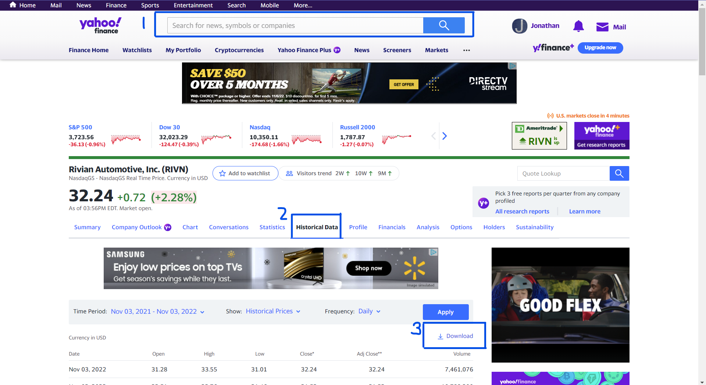

# Predicting Rivian Stock Using Time Series Modeling And Recurrent Neural Networks
## Project Motivation
Transportation is an important part of every day life. Whether the commute is public or private, it is integral as a society to be able to get from point A to point B efficiently. Cars plays an important role in this way of life. However, the impact on the environment that it has had up until the present day has been fairly negative due to carbon emissions from cars. Electric Vehicles seek to disrupt this transportation industry to change the way our cars impact the environment. 

Rivian (RIVN) is one of such companies and because of this, I wanted to try to predict the future stock value of this company. It would be interesting to see in which the trajectory of its stock in this current climate.

## Data Extraction
The information for this project was extracted from the yahoo finance website.

In the bar labeled "1", you can type in its stock exchange ticker "RIVN" and get to the page for its information. Afterwards, there are tabs that give different sets of information. Labeled "2" is "Historical Data" which can be clicked on and will show the data of:

* Date
* Open
* High
* Low
* Close 
* Adj Close
* Volume

The range of data can be selected for whatever range is needed. The range extracted for this project is from IPO 11-1-2021 to 10-25-2022. 

After selecting the range of the data, it can be downloaded to a CSV file through the "download" button labeled "3"

<b>NOTE</b>: This project uses jupyter notebook so a yahoo finance package can also be used to import this data directly to the jupyter notebook. However, I did want to make sure there was a file in this repository that could be used to replicate the outcome of this project.

## Understanding the Data (EDA)

## The Modeling Process

## The Evaluation Process

## The Results

## The Conclusion

# Resources
[Stock market forecasting using Time Series analysis With ARIMA model](https://www.analyticsvidhya.com/blog/2021/07/stock-market-forecasting-using-time-series-analysis-with-arima-model/)

[How to calculate stock returns in Python](https://www.codingfinance.com/post/2018-04-03-calc-returns-py/)

[How to Calculate the Daily Returns And Volatility of a Stock with Python](https://blog.devgenius.io/how-to-calculate-the-daily-returns-and-volatility-of-a-stock-with-python-d4e1de53e53b)

[Forecasting Future Sales Using ARIMA and SARIMAX](https://www.youtube.com/watch?v=2XGSIlgUBDI)
