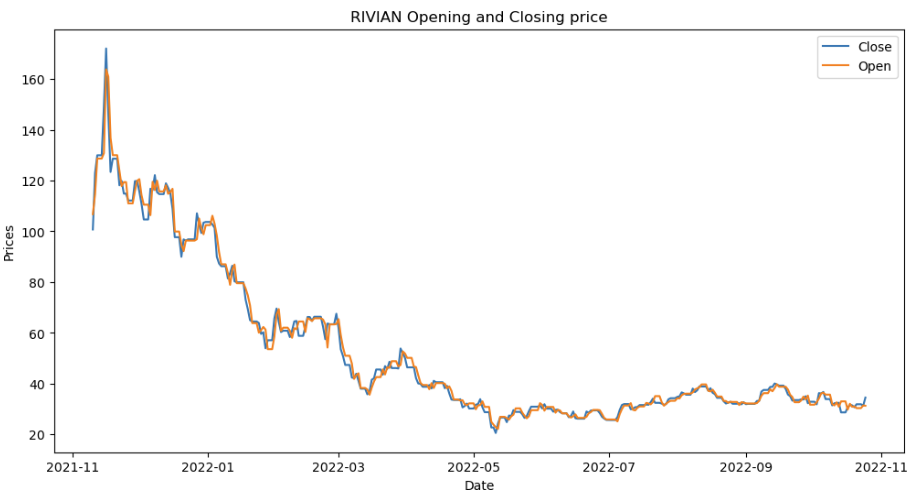
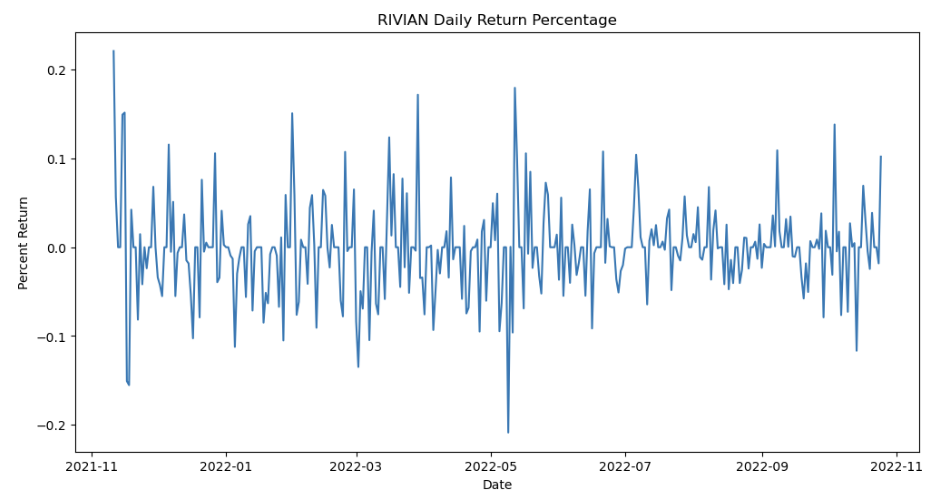
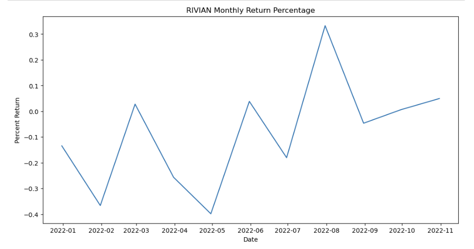
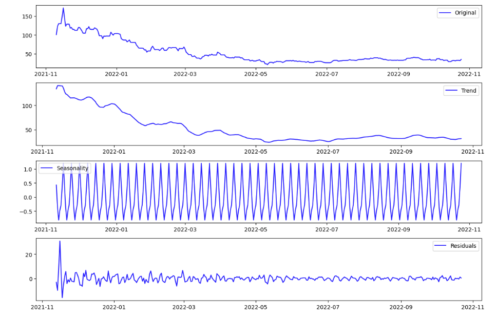
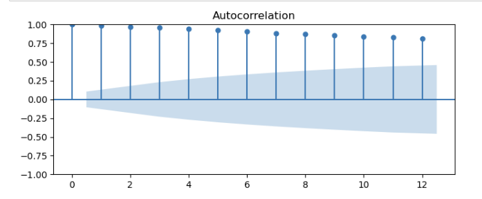
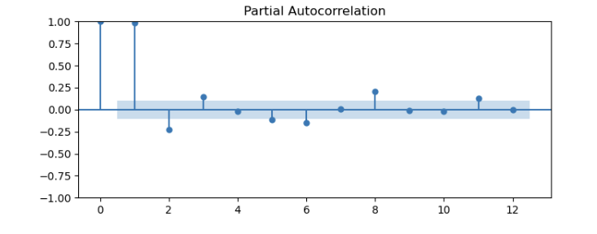
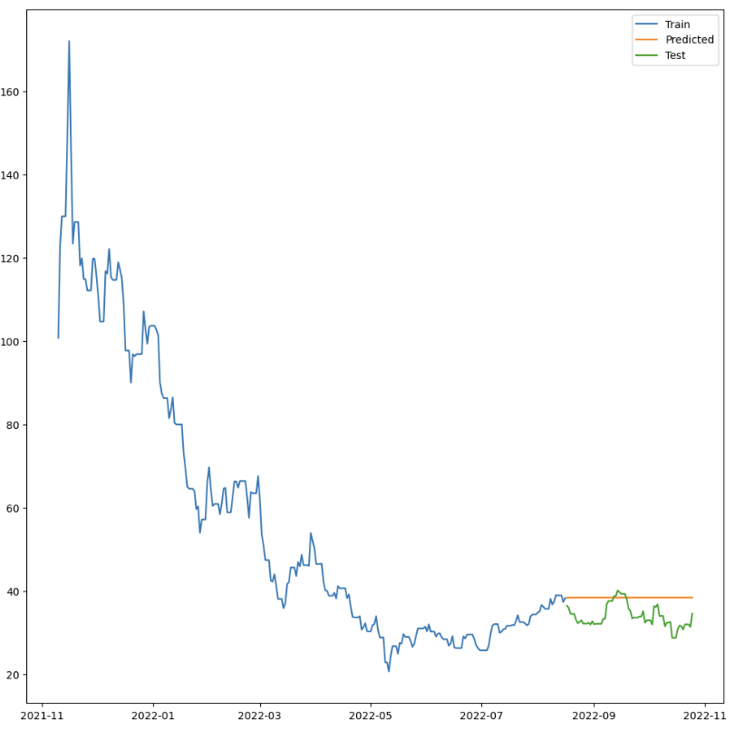
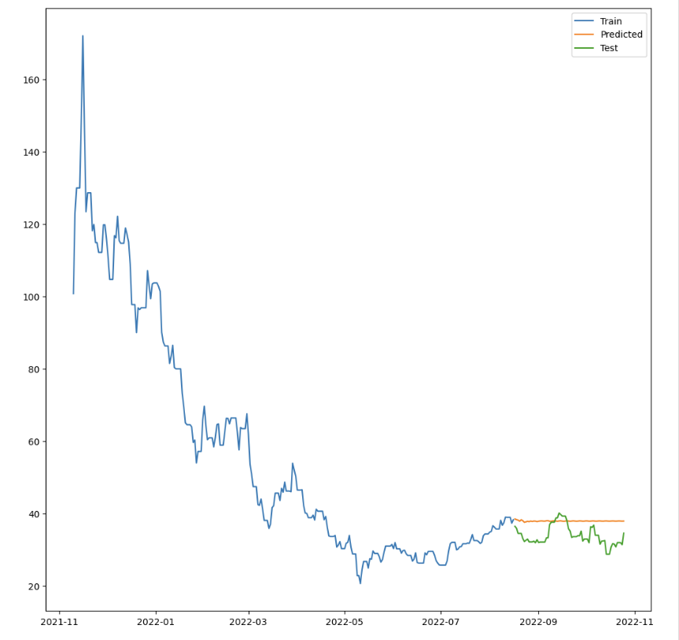
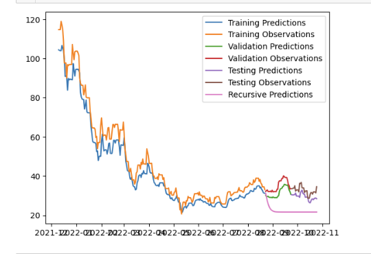
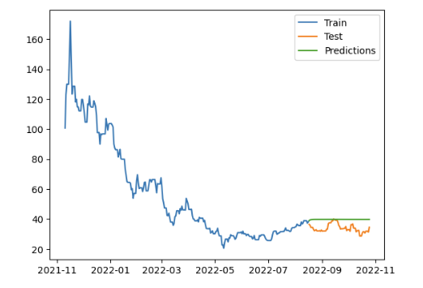

# Predicting Rivian Stock Using Time Series Modeling And Recurrent Neural Networks
## Project Motivation
Transportation is an important part of every day life. Whether the commute is public or private, it is integral as a society to be able to get from point A to point B efficiently. Cars plays an important role in this way of life. However, the impact on the environment that it has had up until the present day has been fairly negative due to carbon emissions from cars. Electric Vehicles seek to disrupt this transportation industry to change the way our cars impact the environment. 


Rivian (RIVN) is one of such companies and because of this, I wanted to try to predict the future stock value of this company. It would be interesting to see in which the trajectory of its stock in this current climate.

## Data Extraction
The information for this project was extracted from the yahoo finance website.


In the bar labeled "1", you can type in its stock exchange ticker "RIVN" and get to the page for its information. Afterwards, there are tabs that give different sets of information. Labeled "2" is "Historical Data" which can be clicked on and will show the data of:

* Date
* Open
* High
* Low
* Close 
* Adj Close
* Volume

The range of data can be selected for whatever range is needed. The range extracted for this project is from IPO 11-1-2021 to 10-25-2022. 

After selecting the range of the data, it can be downloaded to a CSV file through the "download" button labeled "3"

<b>NOTE</b>: This project uses jupyter notebook so a yahoo finance package can also be used to import this data directly to the jupyter notebook. However, I did want to make sure there was a file in this repository that could be used to replicate the outcome of this project.

## Understanding the Data (EDA)
When it comes to doing analysis of a stock, the trend line is extremely important to analyze. To check the direction of the price of a stock, it is critical to visualize the opening and closing price.

The line plot shows that RIVIAN had a strong start to it's price and fell drastically between around December 2021 and May 2022. There were some peaks and valleys in this period but overall, the price fell. After May 2022, the price fairly stabilized, hovering around the $30 mark.




Another aspect to look at is the daily return percentage on the stock. 
If look at the range for the overall daily return from Rivian's stock, it falls between ~0.2% and -0.2%. The daily return does not have a noticable trend associated to it.



The monthly return on the stock also ranges to not too far from the daily price with a range of ~ 0.3% and -0.4%. However, the monthly return shows that could be an upward trend over time.



Volatility was for the day, month and annual. According to Fidelity, "Volatility is the rate at which the price of a stock increases or decreases over a particular period. Higher stock price volatility often means higher risk and helps an investor to estimate the fluctuations that may happen in the future." The volatility for each category is:
* Daily = 0.05
* Monthly = 0.23
* Annually = 0.81                            


## The Modeling Preparation
Time series are unique in a sense that within a given time series, there are components of that time series that make up the original time series. The components that we would be looking for are:
* Trend
* Seasonality
* Noise

In this analysis, the breakdown shows that there is not really an exponential trend in the data. Also, there does not seem to be any seasonality in the data as well. The residual line is given due to using the trend plus seasonality and subtracting from our original series to give us the difference. We can model using the residuals of our data.



To model with time series however, the model has to be stationary. The Dickey-Fuller Test and KPSS Test determined that in order to make our data stationary, the data had to be shifted by 1 time lag. 

The ACF and PACF plots also helped determine what our model's AR and MA values should be.




The ACF plot shows that there's no clear moving averages that need to be modeled and the PACF plot shows that our auto regressive term should be 1.

## The Modeling Process
There were few types of models used in this notebook. There was an I model (Random Walk), ARI (AR + I terms) and an AutoARIMA model. The I model was used as the baseline model to compare against. The ARI model used the recommendations interpreted based on the ACF and PACF plots. Each model was able to get produced using the SARIMAX module. The AutoARIMA model produced a result that utilized the full SARIMAX model.

Two methods of LSTM models were used. The first method included using a windowed dataframe based on the amount of days chosen by the person running the model (in this case 30 days). Based on the windowed dataframe, the LSTM model made prediction both recursively and against the validation and test sets. The second method used a regular train test split and did not include a validation set inside of the LSTM model. The model made predictions both recursively and against the test set. Both methods used almost the same structure as the first iteration had an LSTM input layer, 3 dense layers and included a 0.2 dropout. The second iteration had an LSTM input layer, 3 dense layers with no dropout. What fundamentally different were the shapes added to the input layer.
## The Results
These were the results for the following models:

### <b>I model (Random Walk)</b>


### <b>ARI model (Auto-Regressive with differencing)</b>


### <b>Auto ARIMA model (SARIMAX)</b>


### <b>LSTM Method 1 (Best out of 2 models)</b>


### <b>LSTM Method 2 (Best out of 2 models)</b>



## The Conclusion

The way the models were evaluated was a bit unique as I tried predict to months into the future using a method in which the model will continue to predict again unknown values. It would use it's own predicted values as a real value while try to predict the next day's value. The test set should have acted as a way to evaluate the models against values it may not have known yet but it was much more interesting the see the forecasting ability of the model assuming there were no true values to test against.

The best performing model out of all of the models was the AutoARIMA model. It was the closest in the recursive test to the value.

The LSTM method 2 model was a close second.

 NOTE: all models performed decently for the next day performance but as it tried to predict farther into the future, all of the models ended up leveling out into just one price and could not predict well into the future.

# Resources
[Stock market forecasting using Time Series analysis With ARIMA model](https://www.analyticsvidhya.com/blog/2021/07/stock-market-forecasting-using-time-series-analysis-with-arima-model/)

[How to calculate stock returns in Python](https://www.codingfinance.com/post/2018-04-03-calc-returns-py/)

[How to Calculate the Daily Returns And Volatility of a Stock with Python](https://blog.devgenius.io/how-to-calculate-the-daily-returns-and-volatility-of-a-stock-with-python-d4e1de53e53b)

[Stock Price Prediction & Forecasting with LSTM Neural Networks in Python](https://www.youtube.com/watch?v=CbTU92pbDKw&list=WL&index=2)

[Stock Price Prediction Using Python | Machine Learning | LSTM](https://www.youtube.com/watch?v=mEx8XOYsjXo)

## Repository Structure

```
├── data
├── images
├── .gitignore
├── README.md
├── environment.yml
└── stock_predict_nb.ipynb
```